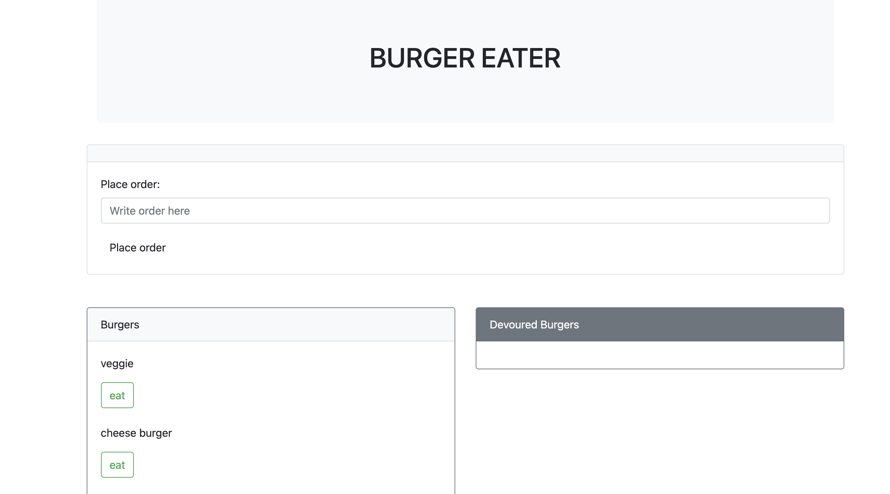

# Burger Eater
## Table of Contents: 
[Project Description](#Project-Description)  
[Usage Information](#Usage-Information)   
[Questions and Contact Information](#Questions-and-Contact-Information)  
[Screenshots](#Screenshots)  
[Heroku](#Heroku)  

## Project Description 
This homework is a burger app that allows users to add burgers, and then eat the burgers. Once "devoured" the burger will go into the devoured column.

## Usage Information 
Click on the heroku link

### Questions and Contact Information 
Github: github.com/Alexgoldman98  
Github username: Alexgoldman98   
Email address: alexgoldman98@gmail.com  
Any Questions should be directed to me using the above contact information.

### Screenshots

### Heroku
https://nodeexpresshandlebars13.herokuapp.com/
